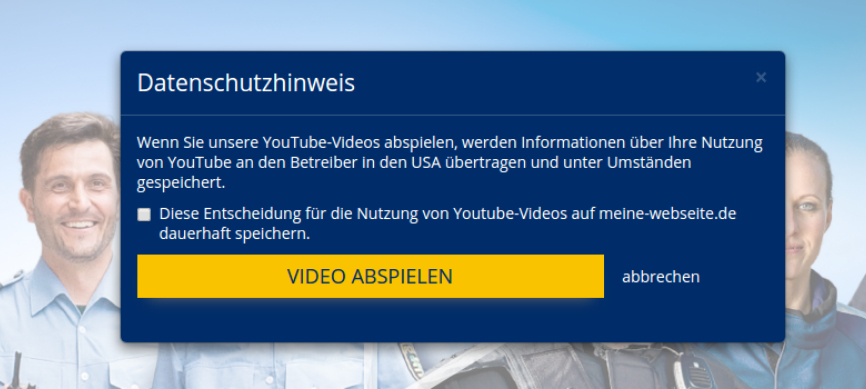

huh.list.backend.module# YouTube

[](https://packagist.org/packages/heimrichhannot/contao-youtube-bundle)
[](https://packagist.org/packages/heimrichhannot/contao-youtube-bundle)
[](https://travis-ci.org/heimrichhannot/contao-youtube-bundle)
[](https://coveralls.io/github/heimrichhannot/contao-youtube-bundle?branch=master)

YouTube bundle aims responsive youtube videos with preview images and better privacy control.
It provides support for content elements and news items.

**An valid [Youtube Data API Key](https://developers.google.com/youtube/v3/getting-started) is required for automatic preview image support (enter on in contao system settings or on your root page).** 

> If you upgrade from heimrichhannot/contao-youtube, see the [upgrade notices](#upgrade-notice-from-heimrichhannotcontao-youtube).

## Features
 
* Responsive youtube videos
* Preview image for youtube videos
    * If no custom image is given, the preview image will be loaded from youtube and saved under 'files/media/youtube/' 
* ConfigElements for [List-](https://github.com/heimrichhannot/contao-list-bundle) and [Readerbundle](https://github.com/heimrichhannot/contao-reader-bundle).
* Privacy mode 
    * In privacy mode the video is displayed, after the user accepted a privacy advice within a modal prompt
    * The user can mark his selection as permanent with a checkbox (state will be saved in a cookie)



## Technical instruction

### Upgrade major version or from heimrichhannot/contao-youtube

See [Upgrade.md](UPGRADE.md)

### Add to list and reader item templates

For usage with [List-](https://github.com/heimrichhannot/contao-list-bundle) and [Readerbundle](https://github.com/heimrichhannot/contao-reader-bundle) you first need to add the config elements in List- and/or Reader config.

Afterwards you can add youtube to your template. The config elements add a formatted value `youtubeVideos` containing an array for each youtube field add by an config element.

```php
$templateData = [
    // ...
    'youtubeVideos' => [
        'youtubeField' => [ // The selected youtube field name from config element
            'video' => '' // Generated default template,
            'data' => [] // Video data for custom templates
        ]
    ]
]
``` 

Example custom template:
```yaml


    

```

### News template

Youtube videos can be added to news templates with ease. Just add the following code (for example: news_full.html5):

```
<?php if($this->youtube && $this->youtube->video): ?>
	<?= $this->youtube->video; ?>
<?php endif; ?>
```

### Preview images from YouTube

To use preview images from youtube, you have to generate an API key (https://developers.google.com/youtube/v3/getting-started) and place it in the contao settings.

## Integrations/Extension
- Integration with [Contao Reader Bundle](https://github.com/heimrichhannot/contao-reader-bundle): [Contao Youtube Reader Bundle](https://github.com/heimrichhannot/contao-youtube-reader-bundle)